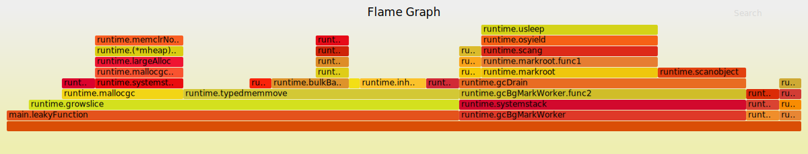

#### 使用go tool和go-torch 性能分析
##### go tool
首先执行代码
>go run leaky.go

然后执行
>go tool pprof http://localhost:6060/debug/pprof/profile
查看cpu信息
或者是
>go tool pprof http://localhost:6060/debug/pprof/heap
查看内存使用
<br><br><br>
默认运行30s采集数据,在pprof里面执行top
```
Fetching profile over HTTP from http://localhost:6060/debug/pprof/profile
Saved profile in /Users/luobangkui/pprof/pprof.samples.cpu.009.pb.gz
Type: cpu
Time: Aug 16, 2018 at 4:29pm (CST)
Duration: 30s, Total samples = 1.10s ( 3.67%)
Entering interactive mode (type "help" for commands, "o" for options)
(pprof) top
Showing nodes accounting for 950ms, 86.36% of 1100ms total
Showing top 10 nodes out of 64
      flat  flat%   sum%        cum   cum%
     290ms 26.36% 26.36%      290ms 26.36%  runtime.usleep
     210ms 19.09% 45.45%      210ms 19.09%  runtime.memclrNoHeapPointers
     110ms 10.00% 55.45%      260ms 23.64%  runtime.bulkBarrierPreWrite
      60ms  5.45% 60.91%       60ms  5.45%  runtime.mach_semaphore_signal
      60ms  5.45% 66.36%       60ms  5.45%  runtime.memmove
      50ms  4.55% 70.91%       50ms  4.55%  runtime.heapBits.bits (inline)
      50ms  4.55% 75.45%       50ms  4.55%  runtime.inheap (inline)
      50ms  4.55% 80.00%      330ms 30.00%  runtime.typedmemmove
      40ms  3.64% 83.64%       40ms  3.64%  runtime.heapBits.next (inline)
      30ms  2.73% 86.36%       30ms  2.73%  runtime.(*wbBuf).putFast (inline)
(pprof)
```
能够查看top n的cpu使用
执行web，会生成对应svg文件，可以直接使用浏览器打开

##### 火焰图go-torch
执行
>go-torch -u http://localhost:6060/debug/pprof/ -p > test.svg
然后浏览器打开test.svg能够看到火焰图
